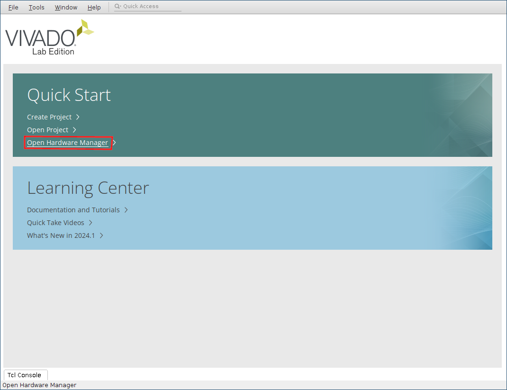

# zeST setup on the ZynqBerry board

The TE0726 "ZynqBerry" board has a particular architecture that makes the initial setup
process less straightforward than the other Zynq 7000-based boards that are supported by
zeST.

This board uses the `clg225` package of the Zynq 7010 SoC, while the other supported
boards use the `clg400` version.
This makes a smaller physical chip with less I/O pins to connect to the outside world.
Among other reduced functionality, the `clg225` chip only features two possible boot
modes instead of four.

The available boot modes are:
 - JTAG: the chip waits for an external computer to upload some configuration data via USB;
 - QSPI boot ROM: the chip runs a bootloader from an on-board, flashable ROM and thus can
boot on its own.

Among the unavailable modes is the ability to boot directly from an SD card.

This page proposes a setup method to have the board boot from a bootloader on its QSPI
ROM, and the bootloader reads the rest of the configuration data from the SD card.
In this way, you only need to flash the ROM once before first use, and then on further
updates you'll only need to replace files on the SD card.

zeST has been tested on a TE0726 board, revision 04.
I currently have no idea whether the following procedure works on previous revisions.

## Required material

You will need specific software and data for the installation.
The list is the following:

 - [Vivado](https://www.xilinx.com/support/download/index.html/content/xilinx/en/downloadNav/vivado-design-tools.html).
You actually only need to install a small subset of the software (Vivado Lab),
so I suggest you download the web installer instead of the huge, whole
distribution blob.
To download Vivado, you'll need to create an account on the AMD website.
Sorry for that.
 - The [ZynqBerry setup files](https://zest.sector1.fr/download/zynqberry_setup.tar.xz).
These are a specific bootloader file `spi_boot.bin` and a boot flashing program
`fsbl_flash.elf`.


## Vivado Lab Edition installation

To be able to flash the ROM, you need the Vivado Lab program installed on your computer.
Since this is a one-time procedure, you can uninstall it as soon as the setup is done.

Run the Vivado installer.
You'll first have to enter your account ID and password.
In the product selection dialog, choose "Lab Edition".

[](img/zynqberry_setup_vivado_install1.png)

Leave the default installation options unchanged.
[](img/zynqberry_setup_vivado_install2.png)

Click Next, choose an installation directory, and Vivado Lab Edition should be installed a few minutes later.

## Cable drivers on Linux

If you are using Linux, you'll need to install the cable drivers manually.
For this you'll need to run an install script that you will find in the installation
directory.
For instance, if you have installed version 2024.1 and the installation directory is
`/opt/Xilinx`, the procedure is as follows:

```
cd /opt/Xilinx/Vivado_Lab/2024.1/data/xicom/cable_drivers/lin64/install_script/install_drivers
sudo ./install_drivers
```


## ROM flashing

Run Vivado Lab then choose "Open Hardware Manager".
[](img/zynqberry_setup_vivado_lab1.png)

Make sure the ZynqBerry is connected to the PC with a USB cable.
Then, click the "Auto Connect" icon.
[](img/zynqberry_setup_vivado_lab2.png)

Right-click the `xc7z010_1 device`, then choose "Add Configuration Memory Device".
[](img/zynqberry_setup_vivado_lab3.png)

Now you need to select the memory type.
In the search field, enter `s25fl128s-3.3v-qspi-x1-single`.
There should be only one corresponding list entry available.
Click on that entry then click OK.
[](img/zynqberry_setup_vivado_lab4.png)

Vivado will then ask you if you want to program the configuration memory device.
Click OK.

Now you need to set up configuration parameters.
 - As the configuration file, use `spi_boot.bin` from the ZynqBerry setup archive.
 - As the Zynq FSBL, choose `fsbl_flash.elf`, from the same archive.

[](img/zynqberry_setup_vivado_lab5.png)

Leave the other options unchanged, then click OK.

The QSPI ROM should now be configured.
If you left the board in QSPI boot mode, you may have a warning message telling you that flash programming
is not supported, but from my expericence it works correctly.

Now you can follow the [regular installation procedure](/doc/getting-started/#installation) to finish the installation.
